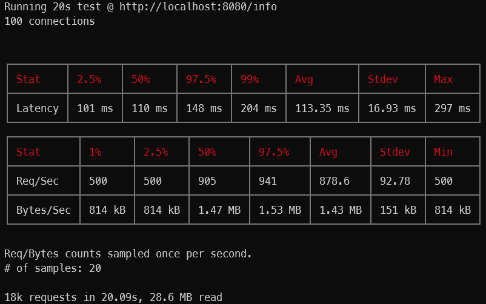
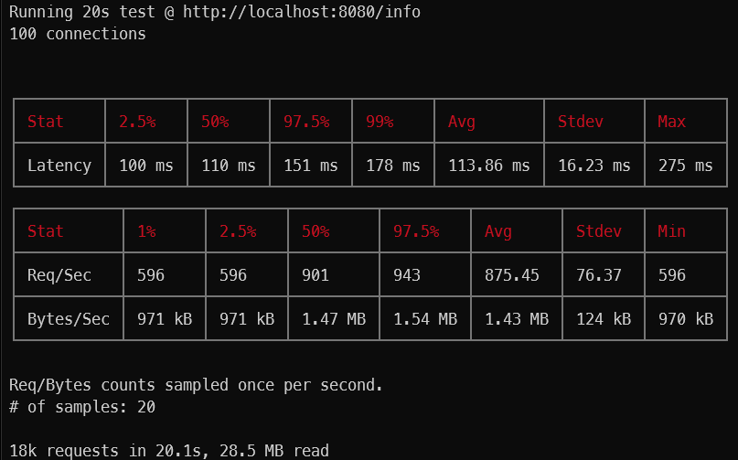

# Artillery + Node built-in profiler

## Pasos a seguir

### Sin console.log()

- correr el servidor con `node --prof server.js`
- en paralelo correr Artillery de la siguiente forma `artillery quick --count 20 -n 50 http://localhost:8080/info > ./profiling/result_onlyInfo.txt`
- parar el servidor
- renombrar el archivo isolate a onlyInfo-v8.log
- correr el comando `node --prof-process onlyInfo-v8.log > ./profiling/result_prof-onlyInfo.txt`

### Con console.log()

- correr el servidor con `node --prof server.js`
- en paralelo correr Artillery de la siguiente forma `artillery quick --count 20 -n 50 http://localhost:8080/info > ./profiling/result_consoleLog.txt`
- parar el servidor
- renombrar el archivo isolate a consoleLog-v8.log
- correr el comando `node --prof-process consoleLog-v8.log > ./profiling/result_prof-consoleLog.txt`

## Conclusioón de las pruebas

En el resultado de la prueba sobre /info sin console.log() se puede oberservar que los ticks son casi la mitad de veces menor que con la misma prueba con console.log()

# Node inspect + autocannon

## Pasos a seguir

- correr `node --inspect server.js`
- ir a chrome://inspect en Chrome
- abrir DevTools fon Node
- ir a la pestaña Profiler
- iniciar
- correr en paralelo `npm test`
- parar el servidor

### Resultados para /info con console.log()

### Resultados para /info sin console.log()

# Autocannon + 0x

## Pasos a seguir

- correr `npm start`
- en paralelo correr `npm test`

### Resultados para /info con console.log()

[console.log](./profiling/console-log_16716.0x/flamegraph.html)

### Resultados para /info sin console.log()

[only-info](./profiling/onlyInfo_4660.0x/flamegraph.html)